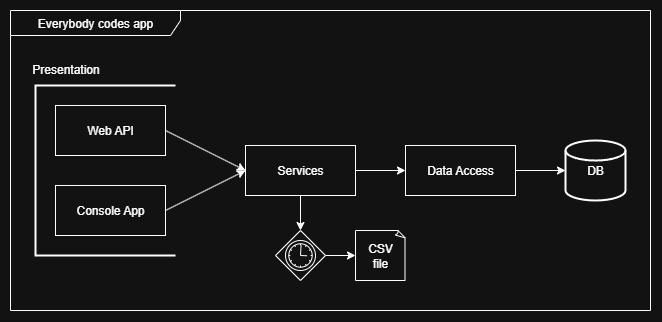
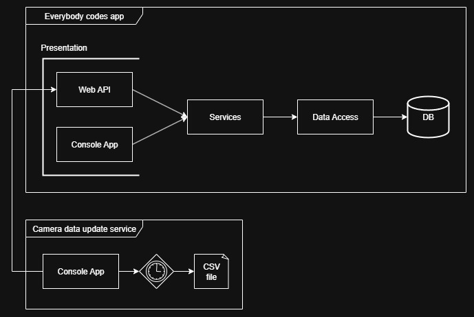

# Work Plan
  The description requires two presentation applications (Console App and Web API) accessing a single data source, so a simple 3 tier application "presentation --> services --> data access" would be sufficient for the use case. I will assume the console application acts as a support app for testing the service logic and data validity, not the API, so a solution with two presentation projects that depend on one service layer is fine choice.

Serving data from a file directly instead from a database is not a good idea for multiple reasons. The solution is to have some background task that reads/parses the .csv file periodically, and write it's contents to a database that is later used for fetching the data.

### Solution One
First (and simplest solution) is to have a background service integrated into the service layer itself, that will run a trigger on a set time interval and perform the parsing/writing of the data to the database.

### Solution Two
To keep things clean we can also move the trigger logic into separate console app (Solution) that runs independently, and whenever an update is triggered it calls an endpoint on the API.

### Other Solutions
Other, more flexible solutions, might involve having a the separate "Camera data update" app access the data layer directly and communicate changes with the server via some message broker like RabbitMQ. This might be more flexible since the data can be updated regardless if the server is running or not, but that, i believe is out of the scope of this assessment.

### Conclusion
For the sake of simplicity I will use "Solution One" and integrate the background service into the service layer of a 3 tier application with two separate presentation layers.